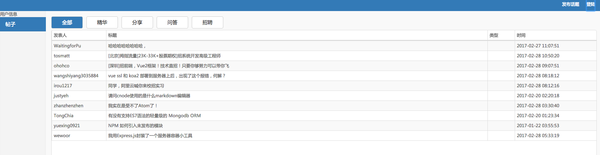

# webpack4FrontEnd
a webpack build project use react for front end


## Get the code

```
$ git clone https://github.com/fengnovo/webpack4FrontEnd.git
```

## Installation

Install all dependencies. 

```
$ npm install
```


## Development

Builds the application and starts a webserver with livereload. The only thing you need to do is to run command `$ gulp` or `$ npm start`.

```
$ npm start 
```

## Build

Builds a minified version of the application in the dist folder.

  
## 运行后的截图
 


